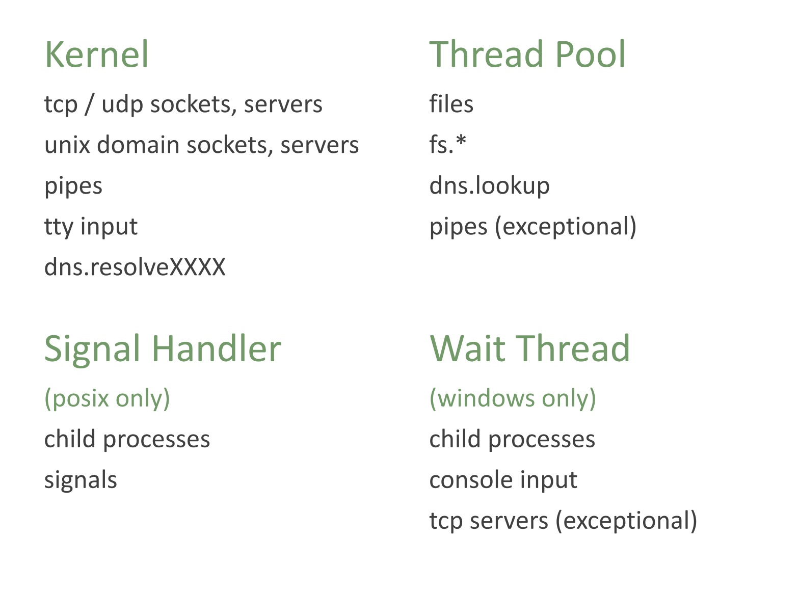

## What is Node.js

Node.js is a powerful, open-source, and cross-platform JavaScript
runtime environment
that allows you to execute JavaScript code outside of a web browser.

Node.js follows event-driven, non-blocking I/O Architecture.

### Motivation for Node.js

From the Initial Talk at JSConf.eu by Ryan Dahl on Node JS

- I/O needs to be done differently
- Threaded concurrency is a leaky abstraction

### Internal Dependencies

Node.js primarily uses below dependencies:

- **V8**: This is the high-performance JavaScript engine developed by Google for Chrome. Node.js uses V8 to execute JavaScript code. It's a core component that significantly impacts Node.js's speed and efficiency.
- **libuv**: This library provides asynchronous I/O support in Node.js. It handles file system operations, networking, and other system-level tasks in a non-blocking way. libuv is crucial for Node.js's event-driven architecture and its ability to handle concurrent operations.
- **OpenSSL**: Node.js uses OpenSSL for cryptographic operations, including SSL/TLS for secure networking. This is essential for building applications that require secure communication.
- **c-ares**: This library is used for asynchronous DNS resolution. It allows Node.js to perform DNS lookups without blocking the main thread, which is important for network-dependent applications.
- **http-parser**: This library parses HTTP requests and responses. It's used for handling network communication in web servers and other HTTP-based applications.
- **zlib**: Node.js uses zlib for compression and decompression. This is useful for handling data efficiently, especially in network applications.

```asciidoc
+-----------------------------------------------------------------+
|                               User code (JS)                    |
+-----------------------------------------------------------------+
|                                                                 |
|       Node.js API (http, fs, crypto, net, buffer, etc...) (JS)  |
|                                                                 |
+-----------------------------------------------------------------+
|                                                                 |
|       Bindings (JS/C++)                 C++ Add-ons (JS/C++)    |
|                                                                 |
+-----------------------------------------------------------------+
|                                                                 |
|   +-----------------+     +---------------------------------+   |
|   |       V8        |     |  Libuv (Event loop, thread pool,|   |
|   |    (JS VM)      |     |       async IO)                 |   |
|   +-----------------+     +---------------------------------+   |
|                                                                 |
|     C-Ares        HTTP-parser        OpenSSL        zlib        |
|                                                                 |
+-----------------------------------------------------------------+
|                                                                 |
|                           Operating System                      |
|                                                                 |
+-----------------------------------------------------------------+
```

## Is it Single or Multi threaded?

It's complicated! - few things are multi threaded, few things are not.

- The user code runs on the single thread (main thread)
- Event loop runs on the single thread.
- File Operations runs on a separate thread (using the Thread-pool)
- Network operations happens using the system kernel directly

> The libuv event loop (or any other API involving the loop or handles, for that matter)
> is not thread-safe except where stated otherwise. - Libuv Design Doc

So, its multi-threaded, but then the user code doesn't have the control to decide which part does or doesn't use the thread-pool.

### What about Worker Threads

Node.js workers leverage the worker_threads module. Each worker runs in its own process. This means they do not share memory directly.

## Async Operations



## Dissecting "non-blocking I/O"

### Synchronous vs. Asynchronous:

**Synchronous (Blocking) I/O**: In synchronous I/O, when a program initiates an I/O operation, it blocks (waits) until that operation is fully completed. The program's execution pauses, and no other tasks can be performed during this waiting period. Think of it like waiting in line at the post office – you can't do anything else until it's your turn.

**Asynchronous (Non-Blocking) I/O**: In asynchronous I/O, when a program starts an I/O operation, it doesn't wait for it to finish. Instead, it continues executing other code. When the I/O operation eventually completes, the program is notified (often through a callback function or an event), and it can then process the result of the I/O operation. It's like ordering a pizza online – you don't wait at the restaurant; you get a notification when it's ready.

### Non-Blocking:

"Non-blocking" is closely related to asynchronous. It means that the I/O operations themselves don't block the program's execution. The program can initiate an I/O operation and immediately return to doing other things. The operating system handles the I/O in the background.

### How this works?

This is a over-simplified explanation, for details read the blog on [The Node.js Event Loop](./nodejs-event-loop)

- **Initiate I/O**: The program starts an asynchronous I/O operation (e.g., reading data from a file).
- **Continue Execution**: The program doesn't wait. It moves on to execute other code.
- **Operating System Handles I/O**: The operating system takes over the I/O operation. It might use techniques like interrupts or polling to monitor the status of the I/O.
- **Notification/Callback**: When the I/O operation is complete (e.g., the data has been read from the file), the operating system notifies the program. This notification might trigger a callback function that was associated with the I/O operation.
- **Process Result**: The program now executes the callback function to process the data or result of the I/O operation.

## References

- [Ryan Dahl: Node JS](https://youtu.be/EeYvFl7li9E?si=Imf9EhxC_5QjQQX-)
- [Node.js: The Documentary | An origin story](https://youtu.be/LB8KwiiUGy0?si=AVDR9sP1AeG7dQDO)
- [Node Interactive 2016 Talk - Everything You Need to Know About Node.js Event Loop - Bert Belder, IBM](https://youtu.be/PNa9OMajw9w?si=CFxugIEBeZTGIHrD)
- [Node Interactive 2016 Talk Presentation](https://drive.google.com/file/d/0B1ENiZwmJ_J2a09DUmZROV9oSGc/view?resourcekey=0-lR-GaBV1Bmjy086Fp3J4Uw)
