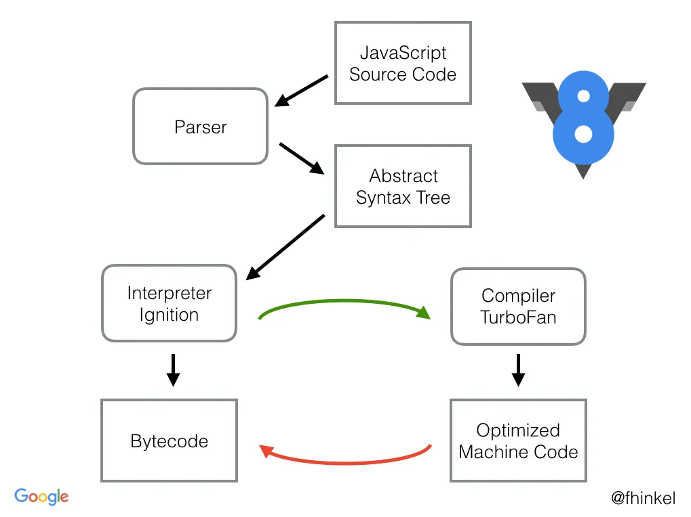

## Introduction

### What is V8

V8 is Google’s open source high-performance JavaScript and WebAssembly engine, written in C++.
It is used in Chrome and in Node.js, among others.

## How your js runs?

## TurboFan pipeline

## References

- [Video: Franziska Hinkelmann: JavaScript engines - how do they even? | JSConf EU](https://youtu.be/p-iiEDtpy6I?si=3pp_sdppQV49IDUe)
- [Video: V8, Advanced JavaScript, & the Next Performance Frontier (Google I/O '17)](https://youtu.be/EdFDJANJJLs?si=r53Gg3SqaGtsEQ-W)
- [Slides: TurboFan: A new code generation architecture for V8 - 2017](https://docs.google.com/presentation/d/1_eLlVzcj94_G4r9j9d_Lj5HRKFnq6jgpuPJtnmIBs88/edit#slide=id.p),
  [PDF Copy](https://github.com/sujeet-pro/learning-resources/blob/main/deep-dives/v8-internals/TurboFan_%20A%20new%20code%20generation%20architecture%20for%20V8.pdf)
- [Slides: An overview of the TurboFan compiler - 2016](https://docs.google.com/presentation/d/1H1lLsbclvzyOF3IUR05ZUaZcqDxo7_-8f4yJoxdMooU/edit#slide=id.p),
  [PDP Copy](https://github.com/sujeet-pro/learning-resources/blob/main/deep-dives/v8-internals/An%20overview%20of%20the%20TurboFan%20compiler.pdf)
- [Slides: TurboFan JIT Design - 2016](https://docs.google.com/presentation/d/1sOEF4MlF7LeO7uq-uThJSulJlTh--wgLeaVibsbb3tc/edit#slide=id.p),
  [PDF Copy](https://github.com/sujeet-pro/learning-resources/blob/main/deep-dives/v8-internals/TurboFan%20TechTalk%20presentation.pdf)
- [Blog: V8: Behind the Scenes (February Edition feat. A tale of TurboFan)](https://benediktmeurer.de/2017/03/01/v8-behind-the-scenes-february-edition/)
- [Video: V8 and How It Listens to You - Michael Stanton](https://youtu.be/u7zRSm8jzvA?si=hli9DbYLKS1uVjDb)
- [Blog: Understanding V8’s Bytecode by Franziska Hinkelmann](https://medium.com/dailyjs/understanding-v8s-bytecode-317d46c94775)
- [BlinkOn 6 Day 1 Talk 2: Ignition - an interpreter for V8](https://youtu.be/r5OWCtuKiAk?si=LYVeIJpVr2muOeKW),
  [Slides](https://docs.google.com/presentation/d/1OqjVqRhtwlKeKfvMdX6HaCIu9wpZsrzqpIVIwQSuiXQ/edit#slide=id.g1357e6d1a4_0_58),
  [Slides PDF](https://github.com/sujeet-pro/learning-resources/blob/main/deep-dives/v8-internals/Ignition_%20An%20Interpreter%20for%20V8%20%5BBlinkOn%5D.pdf)
- [Orinoco: The new V8 Garbage Collector Peter Marshall](https://youtu.be/Scxz6jVS4Ls?si=jDHDbZFF7EWxT05p)
- [Blog: Trash talk: the Orinoco garbage collector](https://v8.dev/blog/trash-talk)

### Suggested Reads

- [Blog: Sea of Nodes - Compiler Concept](https://darksi.de/d.sea-of-nodes/)
- [Video: Mathias Bynens - V8 internals for JavaScript developers](https://youtu.be/m9cTaYI95Zc?si=INnxoUiKDW-DJ1YD)
