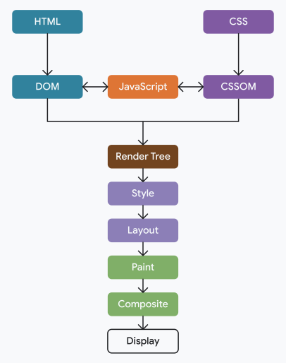
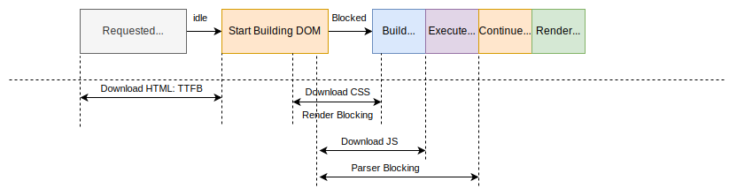

import { Image } from 'astro:assets'

## Flow

1. Constructing the Document Object Model (DOM) from the HTML.
1. Constructing the CSS Object Model (CSSOM) from the CSS.
1. Applying any JavaScript that alters the DOM or CSSOM.
1. Constructing the render tree from the DOM and CSSOM.
1. Perform style and layout operations on the page to see what elements fit where.
1. Paint the pixels of the elements in memory.
1. Composite the pixels if any of them overlap.
1. Physically draw all the resulting pixels to screen.



## DOM Construction Process

import domConstruction from './assets/dom-construction-process.svg?raw'

<Fragment set:html={domConstruction} />

- **Conversion**: The browser reads the raw bytes of HTML off the disk or network, and translates them to individual characters based on specified encoding of the file (for example, UTF-8).
- **Tokenizing**: The browser converts strings of characters into distinct tokens—as specified by the W3C HTML5 standard for example, `<html>`, `<body>`—and other strings within angle brackets. Each token has a special meaning and its own set of rules.
- **Lexing**: The emitted tokens are converted into "objects," which define their properties and rules.
- **DOM construction**: Finally, because the HTML markup defines relationships between different tags (some tags are contained within other tags) the created objects are linked in a tree data structure that also captures the parent-child relationships defined in the original markup: the HTML object is a parent of the body object, the body is a parent of the paragraph object, and so on.

```html
<!doctype html>
<html>
  <head>
    <meta name="viewport" content="width=device-width,initial-scale=1" />
    <link href="style.css" rel="stylesheet" />
    <title>Critical Path</title>
  </head>
  <body>
    <p>Hello <span>web performance</span> students!</p>
    <div></div>
  </body>
</html>
```

import domExample from './assets/dom-construction-example.png'

<Image class='bg-img-light' src={domExample} alt='Dom Construction example' />

## CSSOM Construction Process

import cssomConstruction from './assets/cssom-construction.svg?raw'

<Fragment set:html={cssomConstruction} />

CSS is render blocking as its blocks rendering of parsed content until CSS Object Model (CSSOM) is constructed.
The browser does this to prevent Flash of Unstyled Content (FOUC)

- Render-blocking resources, like CSS, **used to** block all rendering of the page when they were discovered.
- Some browsers (Firefox initially, and now also Chrome) only block rendering of content below the render-blocking resource.

#### Sample Code for the CSSOM

```css
body {
  font-size: 16px;
}
p {
  font-weight: bold;
}
span {
  color: red;
}
p span {
  display: none;
}
img {
  float: right;
}
```


### Explicitly mark CSS as render-blocking

`blocking=render` attribute, added to Chrome 105. This allows developers to explicitly mark a `<link>`, `<script>` or `<style>` element as rendering-blocking until the element is processed, but still allowing the parser to continue processing the document in the meantime.

### Marking CSS as Non Render Blocking

Although CSS is render-blocking by default, it can be turned into a non-render-blocking resource by changing the `<link>` element's media attribute to specify a value that doesn't match the current conditions: `<link rel=stylesheet href="..." media=print>`. This has been used in the past to allow non-critical CSS to load in a non-render blocking fashion.

## JavaScript Execution

import asyncDefer from './assets/asyncdefer.svg?raw'

<Fragment set:html={asyncDefer} />

- Script download can be sync or async.
- Script execution is always parser-blocking
- default - Parser Blocking everythign - Download + Execution
- `async` - Download in parallel, execute ASAP
- `defer` - Download in parallel, execute after DOM
- JS Execution wait for any inflight render-blocking CSS (CSSOM Construction)

### Parser Bocking Scripts

Script tags without `async` or `defer` are parser-blocking.

When the parser encounters a `<script>` element, the browser needs to evaluate and execute the script before proceeding with parsing the rest of the HTML. This is by design, as scripts may modify or access the DOM during a time while it is still being constructed. (using `document.write()`)

### Blocked on CSS, Why?

A parser-blocking `<script>` must also wait for any in-flight render-blocking CSS resources to arrive and be parsed before the browser can execute it. This is also by design, as a script may access styles declared in the render-blocking style sheet (for example, by using `element.getComputedStyle()`).

### Browser Optimization for parser blocking

Blocking the parser can have a huge performance cost—much more than just blocking rendering. For this reason, browsers will try to reduce this cost by using a secondary HTML parser known as the **preload scanner** to download upcoming resources while the primary HTML parser is blocked.

### Oder of execution

Order of execution is guaranteed in blocking scripts and when using defer.
This is not guaranteed when using `async`, since these scripts are executed as soon as they are downloaded.

## Render Tree Construction

The render tree is a subset of the DOM tree that includes only the nodes required to render the page.

{/*  */}
import RenderTree from './assets/render-tree.png'

<Image src={RenderTree} alt='Render Tree Construction' class='bg-img-light' />

## Resources & CRP

### Resources for Initial Render

- Part of the HTML.
- Render-blocking CSS in the `<head>` element.
- Render-blocking JavaScript in the `<head>` element.

Importantly, for the initial render, the browser will not typically wait for:

- All of the HTML.
- Fonts.
- Images.
- Non-render-blocking JavaScript outside of the `<head>` element (for example, `<script>` elements placed at the end of the HTML).
- Non-render-blocking CSS outside of the `<head>` element, or CSS with a media attribute value that does not apply to the current viewport.

### Resource Loading

- CSS is render blocking
- Scripts are parser blocking
- Browsers have a preload scanner, that can continue to download resource, while waiting on blocked resources



### Basic HTML

import crpBasic from './assets/crp-network-basic.png'

<Image src={crpBasic} alt='CRP Basic' class='bg-img-light' />

### Basic CSS

import crpBasicCSS from './assets/crp-network-basic-css.png'

<Image src={crpBasicCSS} alt='CRP with basic CSS' class='bg-img-light' />

### Render Blocking CSS with Async JS

import crpRenderBlockingCSS from './assets/crp-network-render-blocking-css-with-async-js.png'

<Image src={crpRenderBlockingCSS} alt='CRP with render blocking CSS and async JS' class='bg-img-light' />

## Optimizing CRP

### The preload scanner

The preload scanner is a browser optimization in the form of a secondary HTML parser that scans the raw HTML response to find and speculatively fetch resources before the primary HTML parser would otherwise discover them. For example, the preload scanner would allow the browser to start downloading a resource specified in an `` element, even when the HTML parser is blocked while fetching and processing resources such as CSS and JavaScript.

### Best practises to optimize CRP

The general sequence of steps to optimize the critical rendering path is:

- Analyze and characterize your critical path: number of resources, bytes, length.
- Minimize number of critical resources: eliminate them, defer their download, mark them as async, and so on.
- Optimize the number of critical bytes to reduce the download time (number of roundtrips).
- Optimize the order in which the remaining critical resources are loaded: download all critical assets as early as possible to shorten the critical path length.

### Action Items

- Move to Server Side Rendering
- Deffering Javascript
- Preload fonts and using `font-display: swap`
- Prioritize Above the flod.

## References

- [MDN](https://developer.mozilla.org/en-US/docs/Web/Performance/Critical_rendering_path)
- [Understanding the critical path](https://web.dev/learn/performance/understanding-the-critical-path)
- [Optimizing Resource Loading](https://web.dev/learn/performance/optimize-resource-loading)
- [Optimizing the Critical Rendering Path](https://web.dev/articles/critical-rendering-path/optimizing-critical-rendering-path)
- [Constructing the Object Model](https://web.dev/articles/critical-rendering-path/constructing-the-object-model)
- [You Don't Need the DOM Ready Event](https://thanpol.as/javascript/you-dont-need-dom-ready)
- [HTML Spec - Blocking Attribute](https://html.spec.whatwg.org/multipage/urls-and-fetching.html#blocking-attributes)
- [HTML Living Standard](https://html.spec.whatwg.org/multipage/scripting.html)
- [Analysing CRP](https://web.dev/articles/critical-rendering-path/analyzing-crp?hl=en)

#### From ByteByteGo

- Downloaded from [Alex Xu](https://twitter.com/alexxubyte/status/1534201523713867777) Twitter post.


<iframe
  width='560'
  height='315'
  class='yt-embed'
  src='https://www.youtube.com/embed/25fkjIIk2_o?si=3cxf1u6rv_7UK_MU'
  title='YouTube video player'
  frameborder='0'
  allow='accelerometer; autoplay; clipboard-write; encrypted-media; gyroscope; picture-in-picture; web-share'
  referrerpolicy='strict-origin-when-cross-origin'
  allowfullscreen
></iframe>
