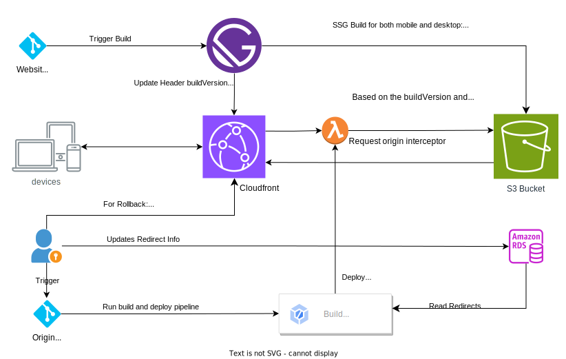

import FigureCaption from '@/components/core/figure-caption.astro'

Static Site Generation (SSG) is a web development technique for creating websites that pre-renders all the content and HTML pages at build time. This means that when a user visits a website generated with SSG, their browser receives a complete, static HTML file that doesn't require any further processing on the server.

## Integrated Flow

import SsgCloudfrontArch from './ssg-cloudfront-arch.svg'

<FigureCaption>
  <SsgCloudfrontArch slot='fig' />
  SSG Cloudfront Architecture Diagram
</FigureCaption>

